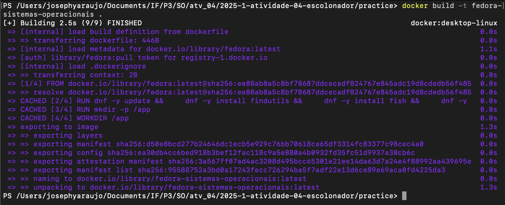
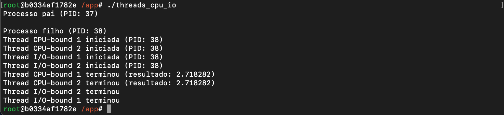

### S.O. 2025.1 - Atividade 04
# **Relatório de atividades práticas: Escalonamento de Tarefas**
### Aluno: Josephy Cruz Araújo 
### Data: 23/05/2025

## Introdução: 
O objetivo desta atividade foi de através de um programa em C estudar o escalonamento de threads no Linux, comparando o comportamento de:

- Threads CPU-bound: Realizam cálculos intensivos (ex.: loops numéricos).
- Threads I/O-bound: Simulam operações de entrada/saída (ex.: sleep, leitura/escrita de arquivos).

Além disso, utilizei ferramentas como htop, time e perf para monitorar:

- Uso de CPU e memória.
- Tempo de execução.
- Priorização de threads pelo escalonador do Linux.

## Relato:
### 1. Criação do Dockerfile, construção da imagem Docker e execução do contêiner com volume: 
Assim como nas outras duas atividades, o exercício foi iniciado com um fork do repositório e criando uma pasta intitulada **"practice"**, e dentro dela foi criando um arquivo dockerfile. Neste arquivo foi inserido o código contido na imagem abaixo: 

Nessa pasta também foi inclúido os arquivo **"threads_cpu_io.c"** que foi necessário à execução do que foi protosto para o exercício. Esse arquivo contém o código abaixo: 

Danto seguimento, executei o comando **"docker build -t fedora-sistemas-operacionais ."** para criar um contêiner Docker com a imagem do Fedora utilizando Power Shell. A imagem foi baixada e o contêiner foi iniciado com sucesso.

Na imagem acima, possível verificar que iniciei o contêiner executando o comando **"docker run -it --name escalonamento -v "${PWD}:/app" fedora-sistemas-operacionais fish**. O terminal interativo do Fish shell foi iniciado.

### 2. Compilação e Execução dos Programas em C:
Após a verificação do conteúdo do armazenado no diretório com o comando **"ls"**, e da compilação do arquivo por meio do comando **"gcc threads_cpu_io.c -o threads_cpu_io -lpthread -lm"**; procedi com a execução do arquvio (**"./threads_cpu_io"**), o qual me retornou a consecutiva imagem:  

Em um segundo terminal, executei o comando **"docker exec -it escalonamento fish"** inicializando outro terminal interativo Fish Shell dentro do mesmo contêiner. Nele, após instalação dos pacotes **"procps-ng"** e **"htop"**, executei o comando htop --pid $(pgrep threads_cpu_io) para visualizar as threads mais graficamente.

Ainda executei o comando **"watch -n 1 "ps -eLf | grep threads_processos""** que acompanha as threads do programa em tempo real. Contudo, como não foram detectadas threads ativas com o nome **"threads_processos"** o programa foi encerrado antes da execução do watch. Acredito que com a correção do comando para **"watch -n 1 "ps -eLf | grep threads_cpu_io""** isso seria sanado, mas como não sabia se era essa intenção do excercíciom mantive o comando original.

### 3. Monitoramento de desempenho das threads:
Nessa etapa do exercício eu procedi com a alteração do código do arquivo e adicionei uma thread para o **"CPU-bound"** e uma para o **"I/O-bound"**.

Além disso, alterei o cálculo inserido na thread **"CPU-bound"**, substituindo o original pelo cálculo de pi usando a fórmula de Leibniz. 

Realizei em seguida a instalação do pacote **"perf"** para executar o comando **"perf stat ./threads_cpu_io"** visando analisar o desempenho e comparar os tempos de execução do programa com dois e três tipos de cada thread, respectivamente. 

Ainda na perspectiva de mensurar o tempo gasto na execucão dos dois tipos de código supracitados, executei o comando **"time ./threads_cpu_io"**. Como retornor para o código com duas e três threads, obitive o seguinte resultado: 

### 4. Análise dos resultados:
Tabela de resultados dos comandos time e perf: 
| Ferramenta | CPU-bound (User) | I/O-bound (Sys) | Context-Switches |
|------------|------------------|-----------------|------------------|
|    time	 |    193.14 ms	    |     3.33 ms     |	       N/A       |
|    perf	 |    149.78 ms     |       N/A	      |         0	     |

Considerando o comando **"time"** é possível verificar que as threads CPU-bound dominaram o tempo de usuário (usr), enquanto as I/O-bound usaram pouco tempo de sistema (sys). Avaliando o tempo total de execução nas imagens, temos cerca de 2 segundos, o que ao meu ver é bem discrepante do tempo gasto se somado os tempos usr+sys. Acredito que isso tenha ocorrido devido as threads I/O-bound ficarem bloqueadas em sleep() durante a maior parte da execução. Enquanto esperavam, não consumiram CPU, mas o tempo de espera foi contabilizado no tempo total. 

Já analisando o comando **"perf"**, tirando o tempo, que teria explicação semelhante ao que já foi comentado para o comando time, observei que não houve trocas de contexto, o que pra mim refroça a ideia de que as threads CPU-bound não foram interrompidas, sendo priorizadas pelo escalonador em detrimento das I/O-bound.
 
## Conclusão: 
Aprendizados
- Observei como o escalonador do Linux prioriza threads CPU-bound em relação as I/O-bound; 
- Consegui perceber que operações como chamadas de sistema tendem consumir menos e "liberam" a CPU para outros processos; 
- Aprendi também a utilizar ferramentas para avaliação de desempenho como htop, perf e time.

Dificuldades
- Necessidade da instalação de pacotes; 
- Interpretação das métricas de hardware coletadas pelos comandos perf e time. 